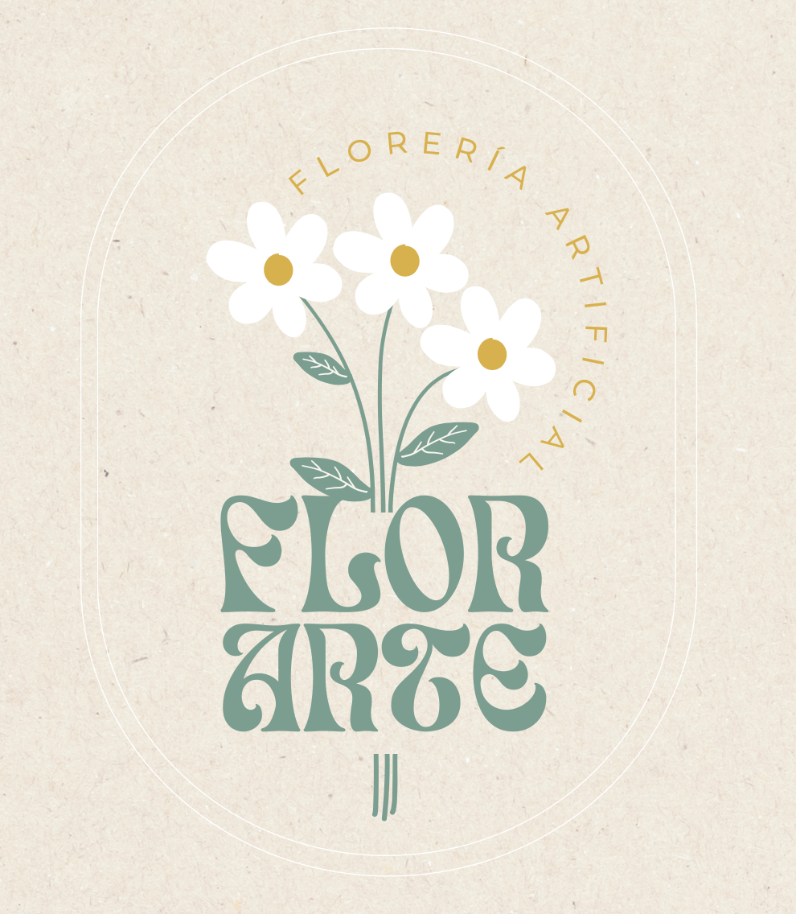

# Application Web Design

  

## About the Project

Flor Arte is an artificial flower shop that I own and manage with my sister. This project focuses on designing and developing a website that represents the brand, showcases its floral products, and provides customers with a clear and attractive way to learn about the business.

Because I am directly involved in Flor Arte, I understand the brand’s identity, products, customers, and day-to-day needs. This knowledge will help me design a website that reflects the essence of the business while providing a practical and user-friendly experience.

## Student Information

- **Name:** Giovanna Ocampo Lopez
- **Registration number:** Al03009988
- **Degree:** Software Development Engineering
- **Semester:** 8th and last semester

## Subject Information

- **Subject:** WEB DESING ACT 1
- **Professor:** Jonathan Alexis Puente Guerrero

